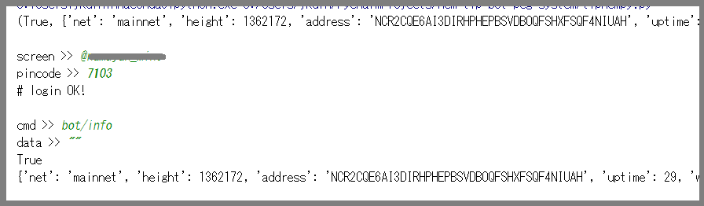

tipnem-py
=========


[Tipnem](https://namuyan.github.io/nem-tip-bot/index)を扱う為のライブラリ。  
Python3で動きます。

Requirement
----------
[websocket-client](https://github.com/websocket-client/websocket-client)

## テストコードを走らせる。
  
ログインして適当なコマンドを送る。
```bash
python3 tipnem.py
```

***

## ソースに組み込む。
```python
from tipnem import WebSocketClient
ws = WebSocketClient("ws://153.122.86.46:8088")
 
# コマンドをリクエスト(okがTrueでなければresultにエラー文)
ok, result = ws.request("bot/info")
```

## Licence
MIT